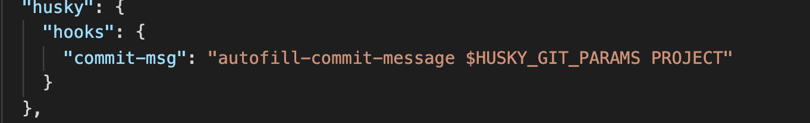
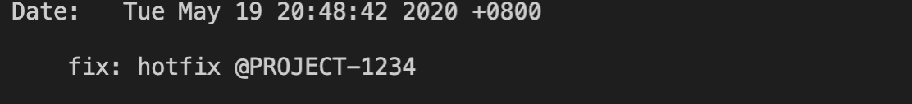

# autofill-commit-message

从 branchname 中截取固定格式关键词（@***），并自动补充到 commit message 中。

### 安装

```
npm i autofill-commit-message -D 
```

### 应用场景

将 branchname 中的 jiraId 截取并补充到 commit message 中，无需每次提交时填写 jiraId。

### 使用

该插件基于 git hook commit-msg 开发，建议使用 husky 添加 hook。

1. 安装 husky (已安装请忽略)

npm i -D husky 

2. 配置 husky 

autofill-commit-message 需要两个参数，第一个为 commit-msg 文件目录, 使用 husky 时，默认传 **$HUSKY_GIT_PARAMS**; 第二个参数为项目名称, 当分支命如 **feature@PROJECT-1234** 时可省略;




3. 切换分支

git checkout -b feature@Pro-1234 或 git checkout -b feature@1234

4. 开发并提交

git commit -m 'fix: hotfix'

## 效果展示 

